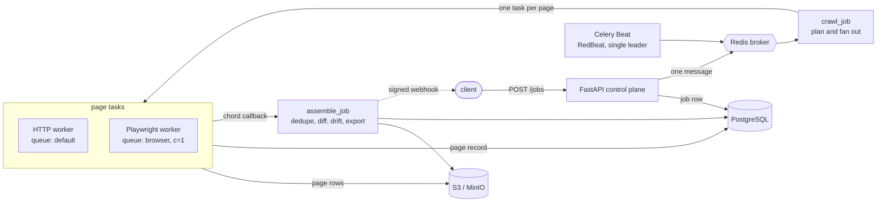
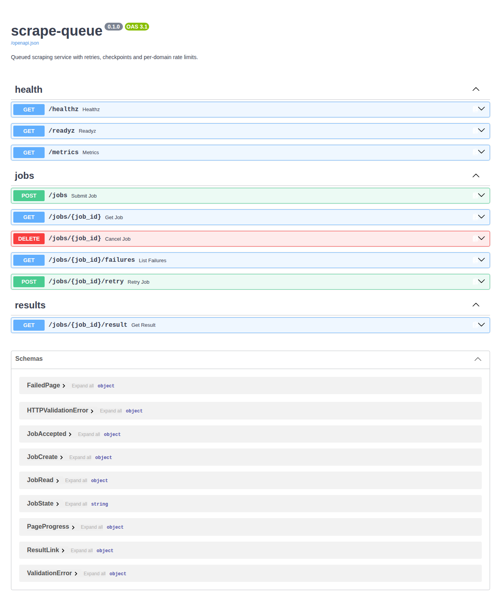

# scrape-queue

A queued scraping service: FastAPI takes the job, Celery workers fetch one page
per task, Playwright is used only where a page genuinely needs rendering.

[](https://github.com/ysajang/scrape-queue/actions/workflows/ci.yml)
[](https://www.python.org/)
[](LICENSE)

---

## Architecture



Guards run in a fixed order on every page: **robots.txt -> SSRF re-check ->
circuit breaker -> distributed rate limit -> fetch**. Checking robots after
spending a rate-limit token wastes the budget; checking the circuit after the
fetch defeats its purpose; re-checking the URL in the worker means a DNS change
between submission and execution cannot be used to reach an internal address.

## Run it

```bash
cp .env.example .env
docker compose up --build -d          # api, workers, beat, postgres, redis, minio
curl -s localhost:8000/readyz
```

Submit a job, poll it, download the result:

```bash
curl -s -X POST localhost:8000/jobs \
  -H 'X-API-Key: dev-key-write' -H 'Idempotency-Key: demo-1' \
  -H 'Content-Type: application/json' \
  -d '{"target":"federal_register","max_pages":3,"output_format":"csv"}'
# {"id":"98e4e1fa-...","state":"PENDING","idempotent_replay":false}

curl -s localhost:8000/jobs/98e4e1fa-... -H 'X-API-Key: dev-key-write'
curl -s localhost:8000/jobs/98e4e1fa-.../result -H 'X-API-Key: dev-key-write'
```

Observability stack (Flower, Prometheus, Grafana, Jaeger) is opt-in:

```bash
docker compose --profile observability up -d
```

## Output

`GET /jobs/{id}` while it runs and after it finishes:

```json
{
  "id": "98e4e1fa-e189-41bc-930e-07e7b2150a7b",
  "state": "SUCCEEDED",
  "target": "federal_register",
  "fetcher": "http",
  "progress": {"pages_total": 3, "pages_done": 3, "pages_failed": 0, "rows": 60},
  "attempts": 1,
  "result_key": "jobs/98e4e1fa-.../result.csv",
  "started_at": "2026-09-10T00:03:49.863042Z",
  "finished_at": "2026-09-10T00:03:51.038162Z"
}
```

`GET /jobs/{id}/result` returns a presigned link rather than the file, so a
large CSV never occupies an API worker:

```json
{
  "url": "http://minio:9000/scrape-results/jobs/98e4e1fa-.../result.csv?X-Amz-Algorithm=...",
  "expires_in": 900,
  "content_type": "text/csv",
  "rows": 60
}
```

The CSV itself:

```csv
document_number,title,type,publication_date,html_url
2026-18396,Agency Information Collection Activity Under OMB Review,Notice,2026-09-09,https://www.federalregister.gov/documents/2026/09/09/2026-18396/...
2026-18394,Privacy Act of 1974; System of Records,Notice,2026-09-09,https://www.federalregister.gov/documents/2026/09/09/2026-18394/...
```

Pages that failed permanently are kept, not swallowed:

```bash
curl -s localhost:8000/jobs/{id}/failures -H 'X-API-Key: dev-key-write'
# [{"page": 4, "url": "...", "attempts": 6, "error": "504 from ...", "last_attempt_at": "..."}]
```



## API

| Method | Path | Scope | Notes |
| --- | --- | --- | --- |
| `POST` | `/jobs` | write | `Idempotency-Key` supported; 429 when the queue is at capacity |
| `GET` | `/jobs/{id}` | read | state and live page progress |
| `DELETE` | `/jobs/{id}` | write | revokes and terminates a running job |
| `POST` | `/jobs/{id}/retry` | write | re-drives a finished job as a new one |
| `GET` | `/jobs/{id}/failures` | read | permanently failed pages |
| `GET` | `/jobs/{id}/result` | read | presigned download link |
| `GET` | `/healthz` `/readyz` `/metrics` | none | liveness, dependency readiness, Prometheus |

## Targets

A target is a YAML file, so adding a site is one file plus a fixture.

| Target | Fetcher | Why | Pagination |
| --- | --- | --- | --- |
| `federal_register` | http | Public JSON API; the HTML search paths are disallowed by robots.txt | `?page=N` |
| `grants_api` | http | Public JSON endpoint, no rendering required | POST offset `startRecordNum` |
| `grants_browser` | browser | `/search` returns the Next.js shell only; rows appear after hydration | `?page=N` |

`grants_api` and `grants_browser` cover the same data on purpose. When an API
exists it is the cheaper and more stable path, and the repository says so rather
than reaching for a browser to look impressive.

**Pages must be URL-addressable.** That is what makes a page an independent task:
retryable in isolation, resumable after a worker dies, safe to redeliver. Sites
whose page 7 only exists after six clicks are rejected by the loader
(`UnsupportedPagination`) instead of being half-supported.

## What this handles

- **Worker death.** `task_acks_late` + `task_reject_on_worker_lost` +
  `prefetch_multiplier=1`. A SIGKILLed worker loses no work; proven by a chaos
  test, with the recovery latency measured and documented below.
- **Redelivery.** `(job_id, page)` is unique, so a second delivery of a page is
  a no-op rather than a duplicated block of rows.
- **Resume.** The checkpoint lives in Postgres, so a job that died at page 40 of
  50 fetches ten pages on the next attempt, not fifty.
- **Poison pills.** A job redelivered past a threshold is parked in the
  dead-letter queue instead of killing workers indefinitely.
- **Rate limiting that survives scaling.** A Redis token bucket per domain: three
  workers share one budget instead of tripling the load on the site.
- **Circuit breaking.** Consecutive failures open a domain; one probe is allowed
  per cooling window.
- **Selector drift.** Rows-per-page is compared against a rolling baseline. A run
  far below it finishes `SUSPECT` rather than shipping an empty CSV as success.
- **Incremental runs.** Row hashes are stored per target, so a scheduled run can
  emit added, changed and removed instead of everything.
- **Backpressure.** Above a queue-depth limit, submission returns 429 with
  `Retry-After` instead of quietly building an hours-deep backlog.
- **SSRF.** Scheme, host allowlist, port, and DNS resolution are all checked, in
  the API and again in the worker.

## Measurements

All numbers from this repository, on the live targets, not estimates.

| What | Result |
| --- | --- |
| `federal_register`, 12 pages, 1 worker | 6.1 s, 240 rows |
| `federal_register`, 12 pages, 3 workers | 6.1 s, 240 rows |
| `federal_register`, 24 pages, 3 workers | 11.6 s, 480 rows |
| `grants_browser`, 1 page | 25 rows, 1.3 s |
| `grants_browser` requests per page | 19 allowed, 9 blocked (images, fonts, trackers) |
| Recovery after `SIGKILL` mid-task | ~100 s (see below) |

Adding workers does **not** speed up a single-domain job, and that is the
distributed rate limiter working: 12 pages at 2 requests/second is ~6 seconds
whether one worker or three are running. Workers scale across domains and
across jobs, not against one site's budget.

**Recovery latency is minutes, not seconds.** Redis has no broker-side
acknowledgement. A message held by a process that died stays invisible until
`visibility_timeout` expires *and* a live worker runs its restore sweep, which
kombu performs on a 10 second timer but acts on every tenth call. Measured
recovery was 100 seconds with a 15 second timeout, so shrinking the timeout
alone does not help. If a job must recover faster, `POST /jobs/{id}/retry` is
the intended path. See [ADR 0007](docs/adr/0007-redis-visibility-timeout.md).

## Tests

```bash
pytest                  # unit, no infrastructure needed
pytest -m integration   # postgres + redis + minio
pytest -m chaos         # kills workers; ~2 minutes
```

Unit tests include selector regression against captured DOM snapshots of the
live targets, so a markup change fails the build without a browser and without
touching the site. Integration tests force the three failure shapes the pipeline
exists for: a timeout, a refusal, and a partial failure. The chaos test kills a
worker mid-task and asserts another one finishes the job.

CI runs lint, `mypy --strict`, unit, integration and chaos suites, builds the
image, scans it with Trivy and publishes an SBOM. It also runs weekly, which is
how selector drift on the live targets gets noticed without anyone watching.

## Documentation

- [Architecture](docs/architecture.md)
- [Decision records](docs/adr/)
- Runbooks: [queue backlog](docs/runbook/queue-backlog.md),
  [domain blocked](docs/runbook/domain-blocked.md),
  [selectors broken](docs/runbook/selector-broken.md)
- [Kubernetes deployment](deploy/helm/scrape-queue/) with KEDA queue-depth autoscaling
- [Load test](loadtest/jobs.js) (k6)

## Scope

Public pages only. No login flows, no CAPTCHA solving, no paywall circumvention.
`robots.txt` is honoured by default and the per-domain rate limit is deliberately
conservative. Targets are restricted to a configured host allowlist.

MIT licensed. Built on [scrape-kit](https://github.com/ysajang/scrape-kit).
